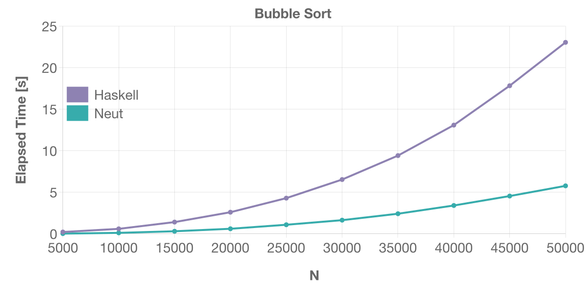
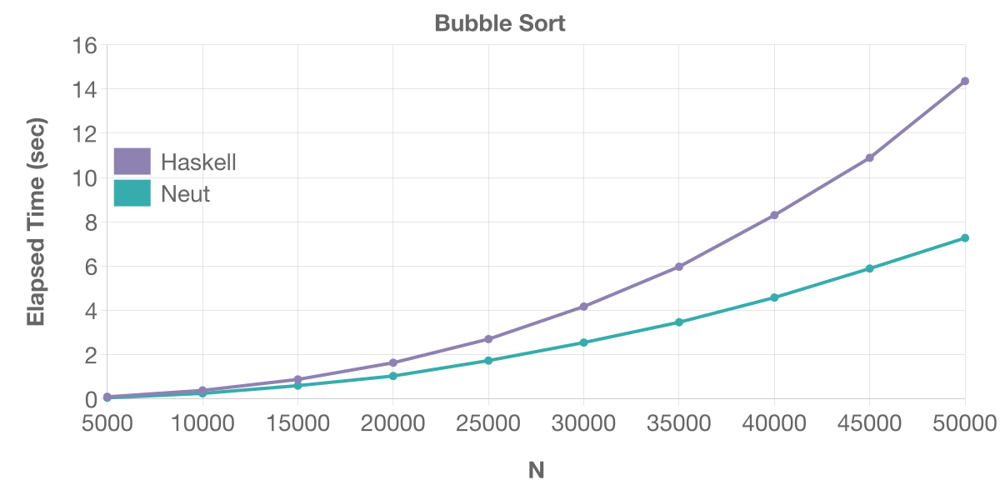
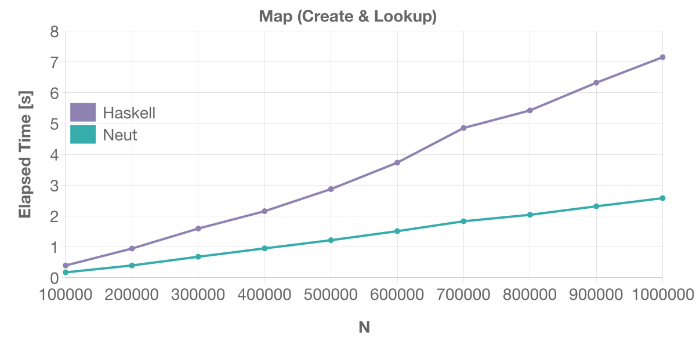
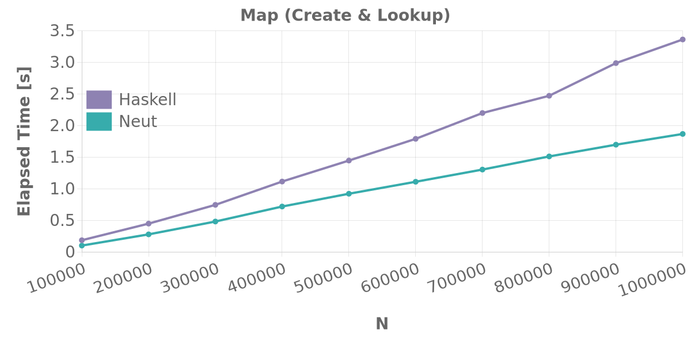
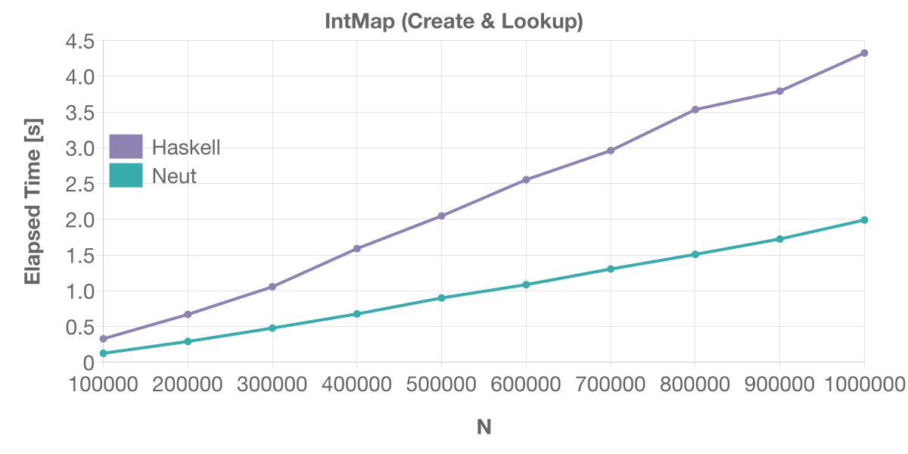
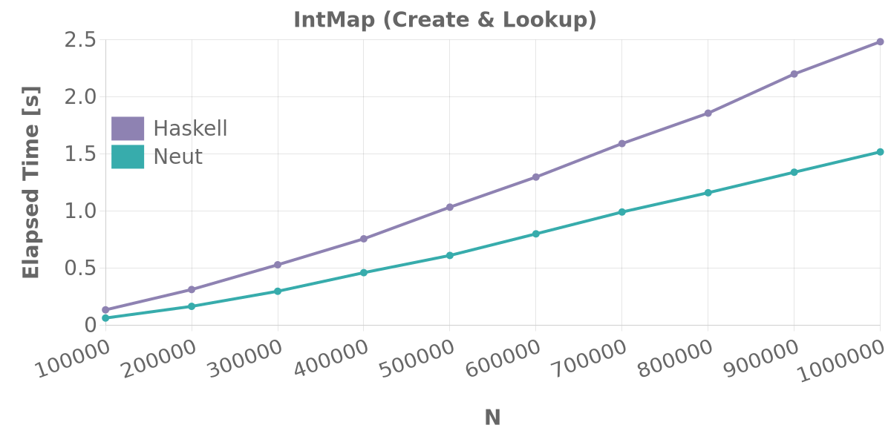

# Benchmarks

You can find the source files for the following benchmarks [here](https://github.com/vekatze/neut/tree/main/bench/action).

## Table of Contents

- [Bubble Sort](#bubble-sort)
- [Dictionary (Create & Lookup)](#dictionary-create--lookup)
- [IntMap (Create & Lookup)](#intmap-create--lookup)
- [Additional Notes](#additional-notes)

## Bubble Sort

This test creates a random list of length `N` and performs bubble-sort on the list[^bubble].

### Linux (AMD64)



### macOS (ARM64)



## Dictionary (Create & Lookup)

This test creates a random dictionary of size `N` and performs random lookups from the dictionary for `N` times.

### Linux (AMD64)



### macOS (ARM64)



## IntMap (Create & Lookup)

This test creates a random intmap of size `N` and performs random lookups from the intmap for `N` times.

### Linux (AMD64)



### macOS (ARM64)



---

## Additional Notes

I used the following hardware in the above benchmarks:

| Platform      | Hardware                                |
| ------------- | --------------------------------------- |
| Linux (AMD64) | HP OMEN 16 2023 (7840HS, 32 GB, Debian) |
| macOS (ARM64) | Apple MacBook Pro 14 (M1 Max, 32 GB)    |

I used the following commands to run benchmarks and generate the graphs:

```sh
just bench-linux amd64-linux # Linux (AMD64)
just bench-darwin arm64-darwin # macOS (ARM64)
```

You may want to read [the Dockerfile in the repository](https://github.com/vekatze/neut/blob/main/build/Dockerfile) to get the list of additional dependencies for running benchmarks. The list includes npm, hyperfine, etc.

Please tell me (hopefully gently) if some of the results are unfair because of reasons I overlooked.

---

[^bubble]: I honestly don't know why the faster one changes depending on the environment here. Please let me know if you find out why.
