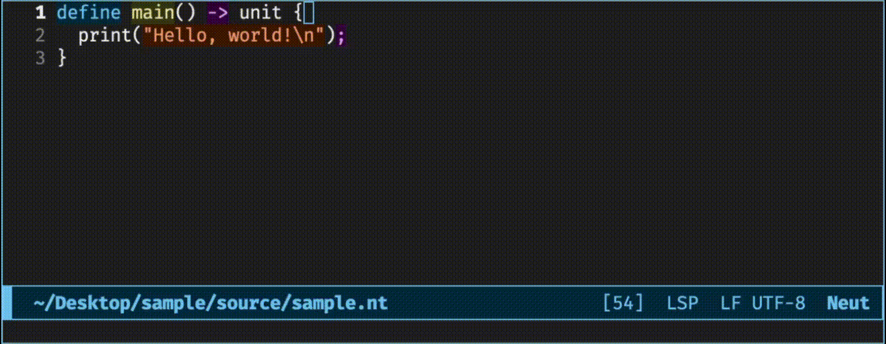
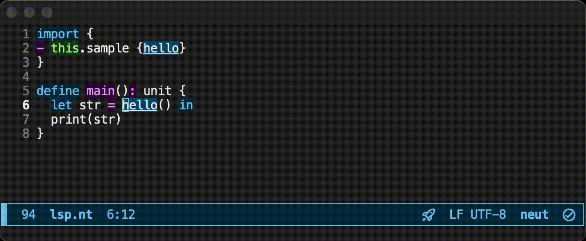
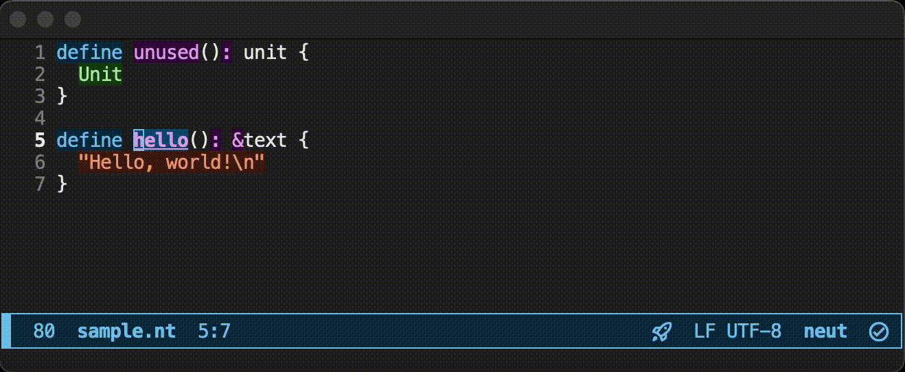
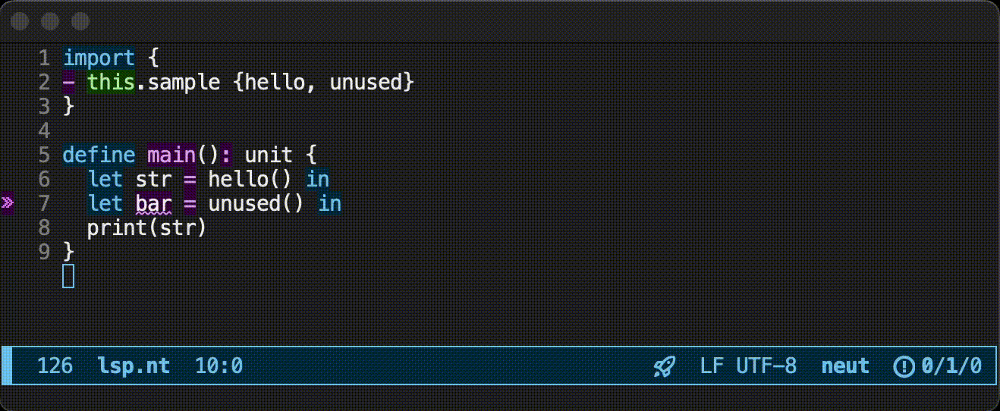
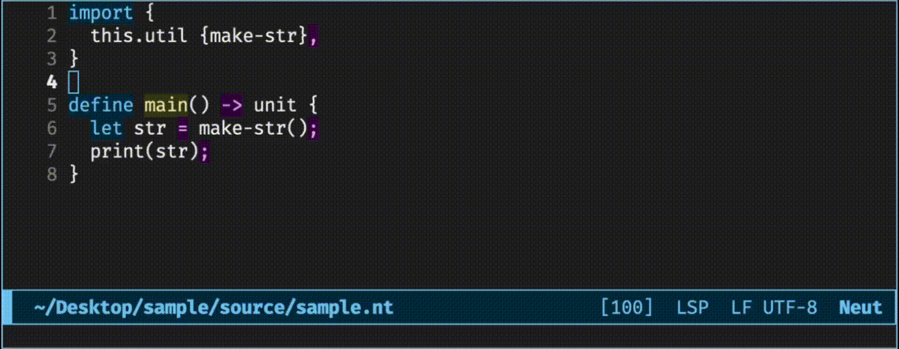
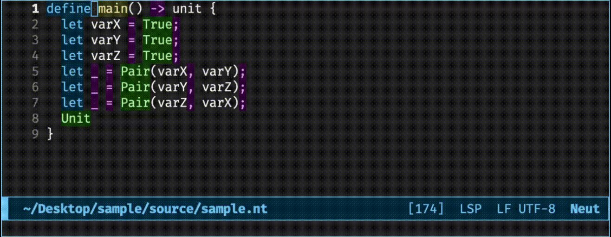

# Lovely LSP Showcase

The compiler contains an LSP server. Let's see what it is like.

## Showcase

The LSP server currently has the following features:

- [Lint](#lint)
- [Completion (+ automatic import)](#completion--automatic-import)
- [Jump to Definition](#jump-to-definition)
- [Find References](#find-references)
- [Format on Save (+ Remove Unused Imports)](#format-on-save--remove-unused-imports)
- [Show the Type of a Variable](#show-the-type-of-a-variable)
- [Highlight Symbols](#highlight-symbols)

### Lint

### Completion (+ automatic import)

### Jump to Definition

### Find References

### Format on Save (+ Remove Unused Imports)

### Show the Type of a Variable

### Highlight Symbols

