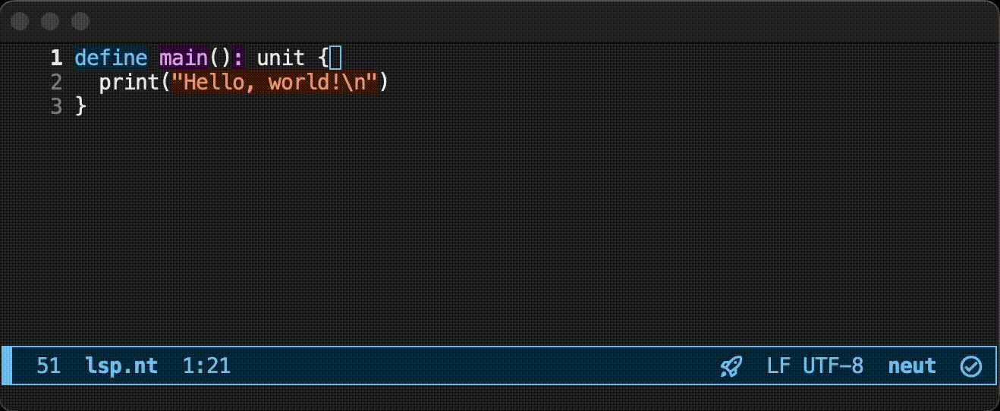

# Lovely LSP Showcase

The compiler also contains an experimental LSP server to provide a better development experience in an editor-agnostic way.

For editor-specific configurations, see [Editor Setup](editor-support.md).

## Showcase

The LSP server currently has the following features:

- Lint
- Complete (+ automatic import)
- Jump to definition
- Find references
- Format on save (+ remove unused imports)
- Show the type of a symbol
- Highlight symbols

### Lint

### Completion (+ automatic import)

### Jump to definition

### Find references

### Format on save (+ remove unused imports)

### Show the type of a symbol

### Highlight symbols

