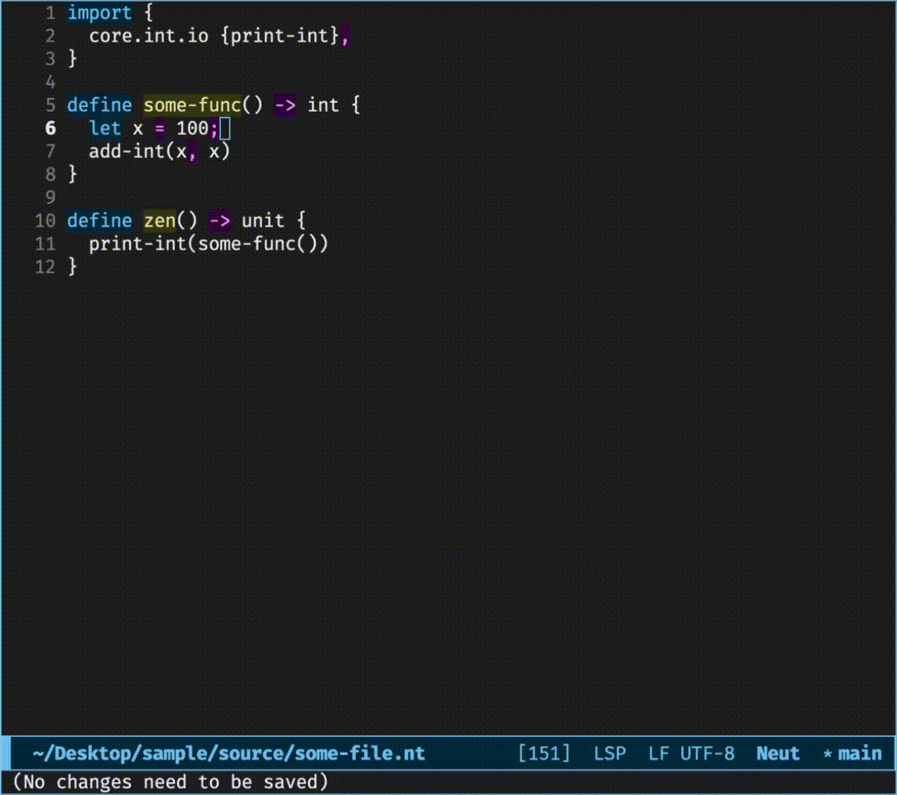

# Rapid Prototyping

You can use the [subcommand](./commands.md#neut-zen) `neut zen` to sketch a function.

Below is an example where Emacs runs `neut zen path/to/file.nt` when `C-c C-c` is pressed:



### Notes for Emacs

The Emacs configuration for the example above looks like the following:

```text
(defun ext/neut-compile ()
  (interactive)
  (compile (concat "neut zen " (buffer-file-name))))

(bind-key "C-c C-c" 'ext/neut-compile 'neut-mode-map)
```

The above example also uses the package `fancy-compilation`:

```text
(use-package fancy-compilation
  :init
  (fancy-compilation-mode t)
  (setq compilation-error-regexp-alist nil)
  (setq compilation-highlight-regexp nil)
  (setq compilation-mode-font-lock-keywords nil)
  (setq fancy-compilation-quiet-prelude t))
```
