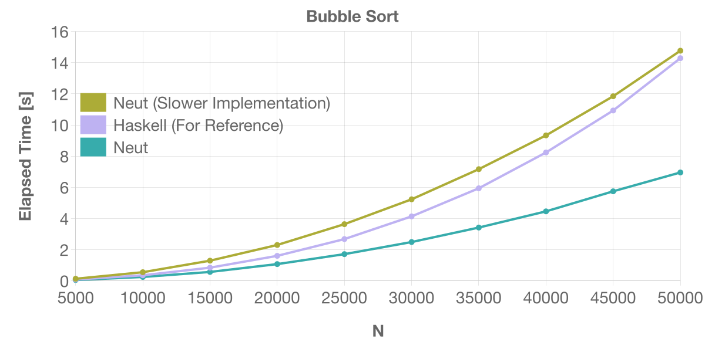

# Static Memory Management

Here, we'll see how to write performant programs in Neut.

## What You'll Learn Here

- How memory regions are handled in Neut
- How to bypass copying resources
- How Neut optimizes memory allocations/deallocations

## Linearity and Memory

In Neut, the content of a variable is _copied_ according to its type _if the variable is used more than once_. Consider the following code:

```neut
// before compilation (pseudo code)
define foo(xs: list(int)): list(int) {
  let ys = xs in // use `xs` (1)
  let zs = xs in // use `xs` (2)
  some-func(ys);
  other-func(zs);
  xs // use `xs` (3)
}
```

In the above code, the variable `xs` is used three times. Because of that, the content of `xs` is copied twice:

```neut
// after compilation (pseudo-code)
define foo(xs: list(int)): list(int) {
  let xs1 = COPY-VALUE(list(int), xs) in
  let xs2 = COPY-VALUE(list(int), xs) in
  let ys = xs1 in
  let zs = xs2 in
  some-func(ys);
  other-func(zs);
  xs
}
```

Also, the content of a variable is _discarded_ _if the variable isn't used_. Consider the following code:

```neut
// before compilation
define bar(xs: list(int)): unit {
  Unit
}
```

In the above code, since `xs` isn't used, the content of `xs` is discarded as follows:

```neut
// after compilation (pseudo-code)
define bar(xs: list(int)): unit {
  let _ = DISCARD-VALUE(list(int), xs) in
  Unit
}
```

Technically speaking, these discarding/copying operations also happen when the variable is an immediate value like an integer:

```neut
define buz(x: int): unit {
  Unit
}

↓


// pseudo-code
define bar(x: int): unit {
  let _ = DISCARD-VALUE(int, x) in
  Unit
}
```

In practice, however, discarding/copying operations on immediate values are optimized away.

In the literature, a use of a variable is called _linear_ if the variable is used exactly once. Neut's compiler translates programs so that every non-linear use of variables becomes linear, ignoring arguments in discarding/copying functions.

If you're interested in how Neut achieves these discarding/copying operations, please see [How to Execute Types](./how-to-execute-types.md).

### To Be Conscious of Cloning Values

Suppose the content of a variable were to be copied simply by using it more than once. In that case, we might suffer from unintended cloning and encounter unexpected performance degradation.

The compiler thus requires us to prefix the name of a variable with `!` when the variable needs to be copied. Let's consider the following code:

```neut
define make-pair(xs: list(int)): pair(list(int), list(int)) {
  Pair(xs, xs)
}
```

When checking this code, the compiler will report an error because the code uses the variable `xs` twice and the variable isn't prefixed with `!`.

You can satisfy the compiler by renaming `xs` into `!xs`:

```neut
define make-pair(!xs: list(int)): pair(list(int), list(int)) {
  Pair(!xs, !xs)
}
```

### Free Variables in a Local Recursion

This `!` is also required when using a free variable in a term-level `define`:

```neut
define multi-print(!message: text): unit {
  let f =
    define self(counter: int): unit {
      if ge-int(counter, 10) {
        Unit
      } else {
        // `!message` is a free variable of `self`
        printf("message: {}\n", [!message]);
        self(add-int(counter, 1))
      }
    }
  in
  f(0)
}
```

This is because free variables in a term-level `define` are cloned during recursion. Seeing how the above code is compiled might be illuminating:

```neut
// `self` is now closed thanks to the new parameter `!m` (lambda lifting)
define self(counter: int, !m: text): unit {
  if ge-int(counter, 10) {
    Unit
  } else {
    // 💫 note that `!m` is used twice
    printf("message: {}\n", [!m]);
    self(add-int(counter, 1), !m)
  }
}

define multi-print(!message: text): unit {
  let f =
    function (counter: int) {
      self(counter, !message)
    }
  in
  f(0)
}
```

### Cloning Values For Free

The prefix `!` is unnecessary if the variable can be copied for free. For example, the following code will typecheck:

```neut
define make-pair(x: int): pair(int, int) {
  Pair(x, x)
}
```

because we can "copy" integers for free (by simply using the same `x` twice).

## The Problem: Excessive Copying

Now, suppose we defined a function `length` as follows:

```neut
define length(xs: list(int)): int {
  match xs {
  | Nil =>
    0
  | Cons(_, ys) =>
    add-int(1, length(ys))
  }
}
```

Also, suppose that we used this `length` as follows:

```neut
define use-length(!xs: list(int)): unit {
  let len = length(!xs) in // use `length` to calculate the length of `!xs`
  some-function(len, !xs) // then use `len` and `!xs`
}
```

Note that the variable `!xs` is used twice. Therefore, in this example, the content of `!xs` is copied _just to calculate its length_. This is a disaster. The end of the world. Every wish is crushed into pieces.

Luckily, there is a loophole for this situation.

## The Solution: Noema Type

We need a way to bypass excessive copying. Here come _noema types_.

For any type `t`, Neut has a type `&t`. We'll call this the noema type of `t`. Let's introduce some terminologies:

- We'll call a term `e` a noema if the type of `e` is a noema type.
- We'll say that a term is noetic if the type of the term is a noema type.

Unlike ordinary terms, _a noema isn't discarded or copied even when used non-linearly_. By using this behavior, we can avoid the disaster we have just seen.

Let's see how it works. We first redefine `length`. If the type `t` is an ADT type, you can inspect its content using `case`:

```neut
define length(xs: &list(int)): int {
  case xs {
  | Nil =>
    0
  | Cons(_, ys) =>
    add-int(1, length(ys))
  }
}
```

The main difference between `case` and `match` is that `case` doesn't perform `free` against its arguments. Because of that, this new `length` doesn't consume `xs`.

Also, note that the newly-bound variables in `case` are automatically wrapped with `&(_)`. For example, in the above example, the type of `ys` is not `list(int)`, but `&list(int)`.

The `use-length` then becomes as follows:

```neut
define use-length(xs: list(int)): unit {
  let len = length( ??? ) in
  some-function(len, xs)
}
```

We need a way to create a noetic version of `xs: list(int)`.

## Creating a Noema

We can create a noema using `let-on`.

```neut
define use-length(xs: list(int)): unit {
  // 🌟
  let len on xs =
    // xs: &list(int)
    length(xs)
  in
  // xs: list(int)
  some-function(len, xs)
}
```

`on` takes a comma-separated list of variables. Variables specified there are then cast to a noema in the body of the `let` and cast back to non-noetic values in its continuation.

The syntax `let-on` is conceptually the following syntax sugar:

```neut
let result on x = e in
cont

// ↓ desugar

let x = unsafe-cast(a, &a, x) in // cast: `a` ~> `&a`
let result = e in                // (use `&a`)
let x = unsafe-cast(&a, a, x) in // uncast: `&a` ~> `a`
cont
```

The result of `let-on` (that is, `len` in this case) can't include any noetic term. This restriction is required for memory safety. If interested, please see the [corresponding part of the language reference](terms.md#on) for more information.

## Embodying a Noema

Incidentally, you can also create a value of type `a` from a value of type `&a`, as follows:

```neut
define make-pair-from-noema<a>(x: &a): pair(a, a) {
  Pair(*x, *x)
}
```

By writing `*e`, you can clone the content of the noema `e` along the type `a`, keeping the content intact.

## Allocation Canceling

Let's see another aspect of Neut's memory management. The compiler can sometimes optimize away memory allocation thanks to its static nature. Consider the following code:

```neut
data int-list {
| Nil
| Cons(int, int-list)
}

// [1, 5, 9] => [2, 6, 10]
define increment(xs: int-list): int-list {
  match xs {
  | Nil =>
    Nil
  | Cons(x, rest) => // ← "the `Cons` clause"
    let foo = add-int(x, 1) in
    let bar = increment(rest) in
    Cons(foo, bar)
  }
}
```

The expected behavior of the `Cons` clause would be something like the following:

1. obtain `x` and `rest` from `xs`
2. `free` the outer tuple of `xs`
3. calculate `foo (= add-int(x, 1))` and `bar (= increment(rest))`
4. allocate memory region using `malloc` to represent `Cons(foo, bar)`
5. store the calculated values to the pointer and return it

However, the compiler knows the following two facts during compilation:

- The size of outer tuples of `Cons(x, rest)` and `Cons(foo, bar)` are the same
- The outer tuple of `Cons(x, rest)` will never be used after extracting its contents

Thanks to this knowledge, the compiler can optimize away a pair of `free` and `malloc`, as follows:

1. obtain `x` and `rest` from `xs`
2. calculate `foo (= add-int(x, 1))` and `bar (= increment(rest))`
3. store the calculated values to `xs` (overwrite)

When a `free` is required, the compiler looks for a `malloc` in the continuation that is the same size and optimizes away such a pair if one exists. The resulting assembly code thus performs in-place updates.

### How Effective Is This Optimization?

Below is the result of benchmarking of a bubble sorting program. This test creates a random list of length `N` and performs bubble sort on the list.



This benchmark executes the following `sort` function:

```neut
data int-list {
| My-Nil
| My-Cons(int, int-list)
}

nominal {
  _insert(v: int, xs: int-list): int-list,
}

// 🌟
inline _swap-gt(cond: bool, v: int, x: int, xs: int-list): int-list {
  if cond {
    My-Cons(x, _insert(v, xs))
  } else {
    My-Cons(v, My-Cons(x, xs))
  }
}

define _insert(v: int, xs: int-list): int-list {
  match xs {
  | My-Nil =>
    My-Cons(v, My-Nil)
  | My-Cons(y, ys) =>
    _swap-gt(gt-int(v, y), v, y, ys)
  }
}

define sort(xs: int-list, acc: int-list): int-list {
  match xs {
  | My-Nil =>
    acc
  | My-Cons(y, ys) =>
    sort(ys, _insert(y, acc))
  }
}

```

The above is the "faster" implementation of bubble sorting in Neut. The key person is `_swap-gt`. The above code defines `_swap-gt` as an inline function. Therefore, in `_insert`, the definition of `_swap-gt` is expanded, which makes allocation canceling of `My-Cons` in `_insert` possible.

The "slower" implementation can be obtained by replacing `inline` at the 🌟 with `define`. In this implementation, since the definition of `_swap-gt` can't be expanded in `_insert`, allocation canceling of `My-Cons` in `_insert` is not possible.

I also added the result of Haskell just for reference.

Additional notes:

- You can find the source files used in this benchmark [here](https://github.com/vekatze/neut/tree/main/bench/action/bubble/source).
- I used my M1 Max MacBook Pro (32GB) to run this benchmark.

If you're interested in more benchmarking results, please see [Benchmarks](./benchmarks.md).

## What You've Learned Here

- Neut uses noema types to bypass copying resources
- The compiler finds pairs of `malloc/free` that are the same size and optimizes them away
